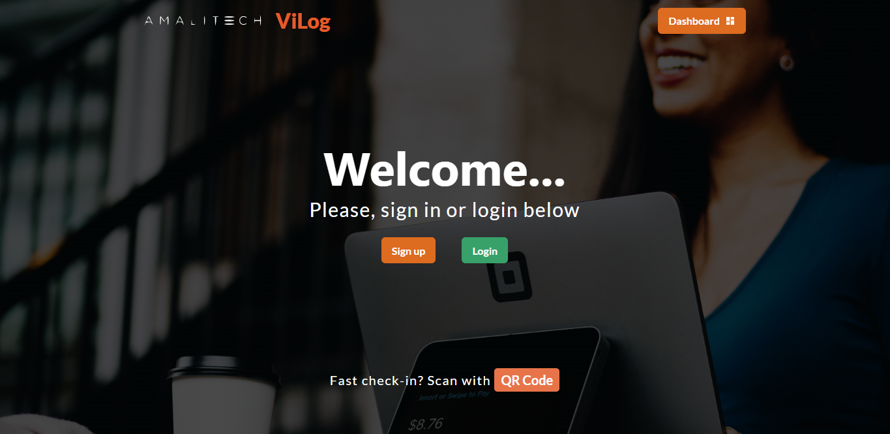
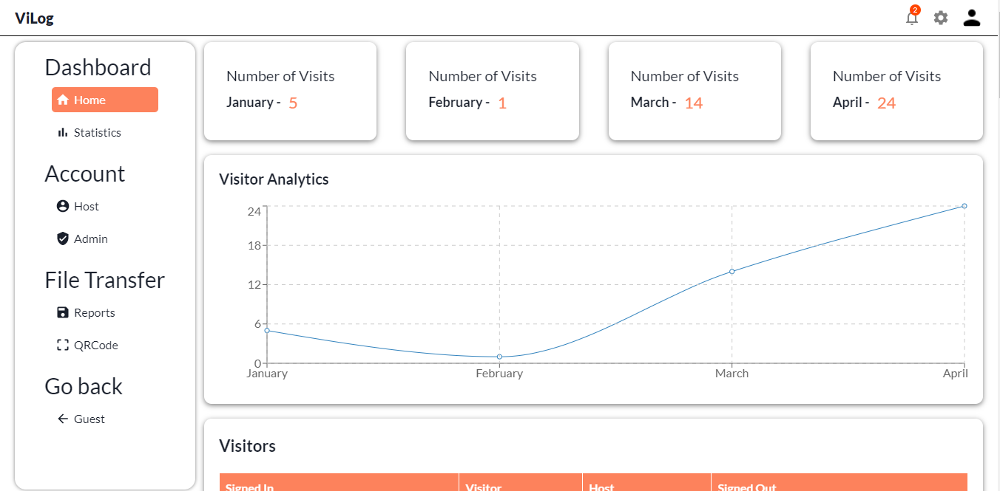

# ViLog

- [Live Project](https://vilog.netlify.app/)
- NB:Faced difficulties hosting Backend to Heroku. Only Frontend is available for now.

####  The challenge was to build an automated monitoring system for AmaliTech that would monitor visitors to AmaliTech premises, and provide accurate and reliable reports to AmaliTech Management.




#### Guest/Visitors are be able to:
- Login and Logout
- Fast check-in in no time
- Register through QR Code which accelerates check-ins for expected guests.
- Smart check-in for recurring visits

#### Hosts/Employees are be able to:
- Receive timely customized email and text notifications when your guest arrives.
- Track Live Visitors and visit times.
- Create custom reports based on data that you have acquired. 
- Export, Share and save reports in csv/pdf formats

#### Admin is be able to:
- Manage Employee Data.
- View more statistical real time Admin dashboard
- Create custom reports based on data that you have acquired. 
- Export, Share and save reports in csv/pdf formats

#### Technologies used:
This project was built using these technologies:
- JavaScript
- CSS
- React UI Libraries (Chakra UI, Material UI, Bootstrap)
- Flexbox
- Git
- Markdown
- React
- Netlify
- Heroku
- Nodejs
- MySQL
- Express js

#### How to start the project?
```sh
FRONTEND:: In the Terminal;
1. install node modules using ***npm install***
2. run ***npm start***

BACKEND:: In the Terminal;
1. install node modules using ***npm install***
2. run ***npm start***
```

#### What we learned?
> ##### Nicholas Darko Brown
    - Experience in using various UI Libraries for fast creation of web apps.
    - Authentication of forms
    - Implementation of node mailer 

> ##### Andrew Koffi N'dirri
    - Implementation of node mailer for sending email to host


#### Future additions
1. Addition of extra security features like signature and selfie for easy identification.